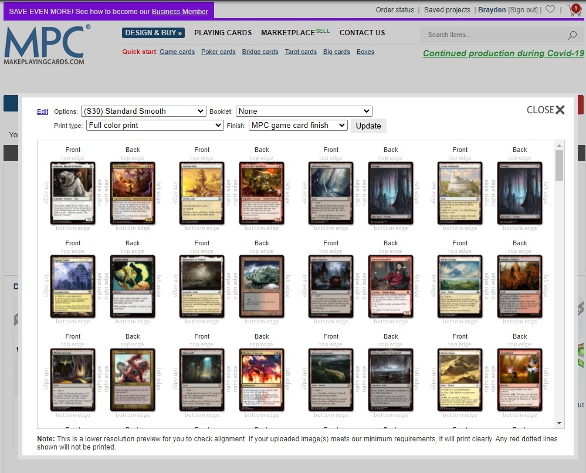

# mpc-backfill
 
# Setup
1. Grab the latest MPC Fill exe from [here](https://github.com/MrTeferi/MPC-Fill/releases)
2. With Ruby 3 installed 
run `gem install nokogiri`

## Running
1. Configure the input decks and output name in the script.
2. Call `ruby main.rb`
3. Run the autofill.exe with the output XML in the same directory

## Example
